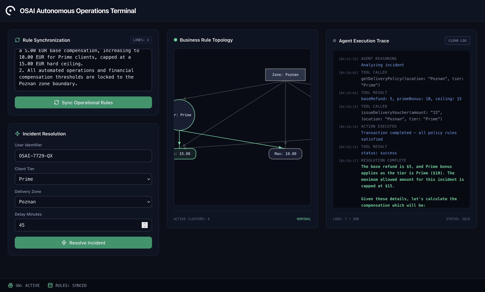
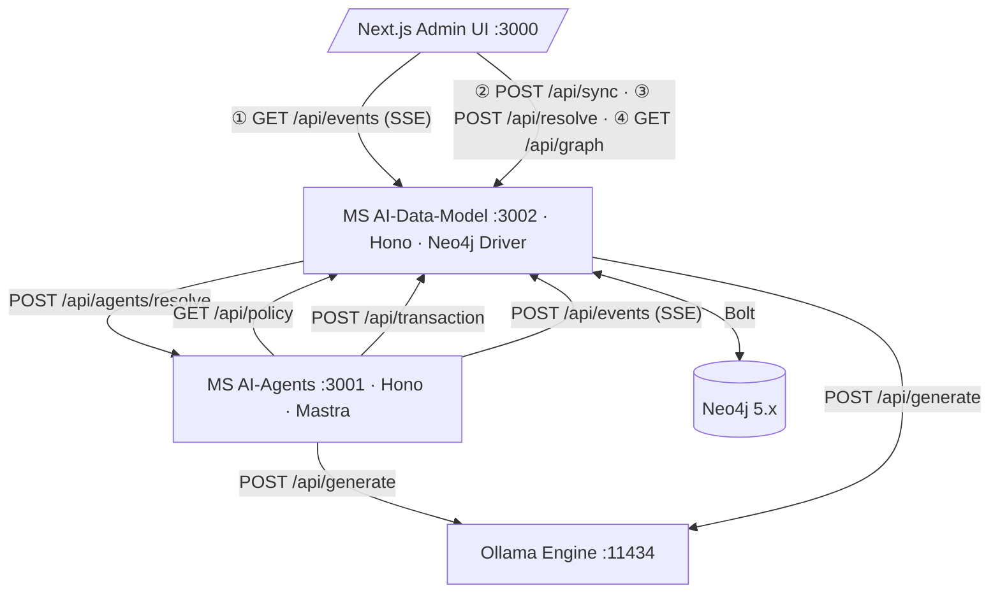

# OSAI: Autonomous AI Compensation Engine with Deterministic Guardrails

[](https://drive.google.com/file/d/1wfi_2UFUx-3gg5wXV_aPIISPOZ4xwFxA/view?usp=sharing)


OSAI (Operational Security Agentic Interface) is a production-ready conceptual **demo** that implements the foundational blueprint of an **Enterprise Agentic OS**. Tailored for localized operations, it showcases a real-world validation of how to strictly decouple fuzzy AI reasoning from deterministic business execution—proving that even a lightweight Local LLM can be structurally bounded from ever violating hard corporate policies, budgeting ceilings, or infrastructure safeguards.



---

## ⚡️ Core Architectural Innovations

* **Local Inference Isolation:** Powered entirely by **Ollama (`0.30.10`)** running **`qwen2.5:3b`** locally. Zero cloud data leaks, minimal cost, and sub-second token generation times optimized for consumer-grade hardware (MacBook M3 18GB RAM).
* **Multi-Layered Guardrails:** 
  * *Infrastructure Layer (Validation Guards):* Enforces strict Zod structure validation, sanitizes LLM markdown output, and manages automated prompt-jitter retry loops.
  * *Domain Layer (Business Guards):* Independent TypeScript execution engine that intercepts all Agent intents and validates them against an absolute state graph in **Neo4j**, completely immune to prompt injection or model hallucination.
* **Modular Infrastructure Inclusion:** Features clean, isolated domain execution contexts where the database cluster encapsulates inside the domain service, tightly bound at runtime via native Docker Compose `include` declarations.
* **Observability Streaming:** Provides real-time event logging and topology updates to the dashboard via a continuous **Server-Sent Events (SSE)** connection.

---

## 🗺 System Blueprint & Request Flow

### Service Topology



## Services

| Service          | Description                                   | Port |
|------------------|-----------------------------------------------|------|
| `ms-ai-data-model` | Gateway, Neo4j-backed invariant engine       | 3002 |
| `ms-ai-agents`     | Mastra-orchestrated LLM reasoning layer      | 3001 |
| `osai-admin-ui`    | Next.js operator dashboard                   | 3000 |

## One-Command Full Stack Up (Recommended)

Spin up the core services, the graph engine, the local inference node, and trigger the automated model-pull initialization layer:
```Bash

cd backend/infrastructure
docker-compose -f docker-compose.orchestration.yml up --build
```
The ollama-init routine will gracefully await the engine's availability, pull down the quantized qwen2.5:3b layer, and exit cleanly without lingering in your RAM.

## Documentation

- [`docs/app.md`](docs/app.md) — Business vision and feature walkthrough
- [`docs/architecture.md`](docs/architecture.md) — System architecture and service specs
- [`docs/coding_standards.md`](docs/coding_standards.md) — Mandatory coding standards
- [`docs/ubiquitous_language.md`](docs/ubiquitous_language.md) — Domain vocabulary
- [`hosts.md`](hosts.md) — Service endpoints and port assignments
